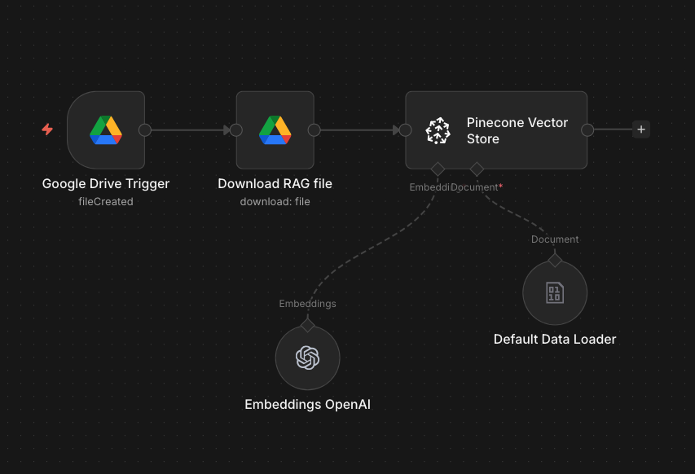
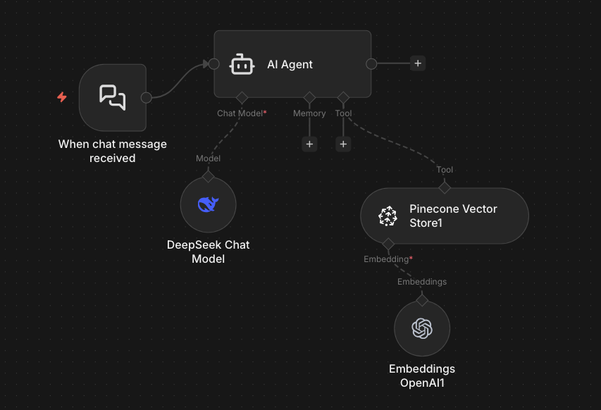

# 🤖 Google Drive RAG Chatbot — n8n + Pinecone + DeepSeek

An automated Retrieval-Augmented Generation (RAG) pipeline built with n8n that ingests documents from Google Drive, stores vector embeddings in Pinecone, and answers questions using DeepSeek Chat with OpenAI embeddings.

---

## 📌 What It Does

When a new file is uploaded to Google Drive, this system automatically:
1. Downloads the document
2. Splits and embeds it using OpenAI `text-embedding-3-small`
3. Stores the vectors in a Pinecone index
4. Makes the document instantly queryable via an AI chat interface powered by DeepSeek

**Demo use case:** Nike product documentation — ask any question about the docs and get accurate, context-aware answers.

---

## 🏗️ Architecture

```
Google Drive (file upload)
        ↓
Google Drive Trigger (n8n)
        ↓
Download File Node
        ↓
Default Data Loader → OpenAI Embeddings (text-embedding-3-small)
        ↓
Pinecone Vector Store (index: demo | dimension: 512 | AWS us-east-1)
```

```
User sends chat message
        ↓
n8n Chat Trigger
        ↓
AI Agent
    ├── Model: DeepSeek Chat
    ├── Tool: Pinecone Vector Store (semantic search)
    └── Embeddings: OpenAI (text-embedding-3-small)
        ↓
Context-aware response returned to user
```

---

## 🛠️ Tech Stack

| Component | Technology |
|---|---|
| Workflow Automation | n8n |
| Vector Database | Pinecone (Dense, AWS us-east-1) |
| Embedding Model | OpenAI text-embedding-3-small |
| LLM | DeepSeek Chat |
| Document Source | Google Drive |
| Trigger | Google Drive file creation event |

---

## 📂 Repository Structure

```
├── README.md
├── workflows/
│   ├── rag-ingestion-pipeline.json     # Google Drive → Pinecone workflow
│   └── rag-chat-agent.json             # Chat agent workflow
├── screenshots/
│   ├── ingestion-workflow.png          # n8n ingestion pipeline screenshot
│   ├── chat-workflow.png               # n8n chat agent screenshot
│   └── pinecone-index.png              # Pinecone index configuration
└── docs/
    └── nike-sample.pdf                 # Sample document used for testing
```

---

## ⚙️ Setup & Configuration

### Prerequisites
- n8n instance (cloud or self-hosted)
- Pinecone account (free tier works)
- OpenAI API key
- DeepSeek API key
- Google Drive access

### Step 1 — Pinecone Index
Create a Pinecone index with these settings:
- **Dimensions:** 512
- **Metric:** Cosine
- **Cloud:** AWS
- **Region:** us-east-1
- **Embedding model:** text-embedding-3-small

### Step 2 — n8n Credentials
Add the following credentials in n8n:
- Google Drive OAuth2
- OpenAI API key
- Pinecone API key
- DeepSeek API key

### Step 3 — Import Workflows
1. Open n8n
2. Go to **Workflows → Import**
3. Import `rag-ingestion-pipeline.json`
4. Import `rag-chat-agent.json`
5. Update credentials in each node
6. Activate both workflows

### Step 4 — Test
Upload any PDF or text document to your configured Google Drive folder. Wait 10-15 seconds, then open the chat interface and ask a question about the document.

---

## 💡 How to Export n8n Workflows as JSON

1. Open your workflow in n8n
2. Click the **⋮ menu** (top right)
3. Select **Download**
4. Save the `.json` file to the `workflows/` folder in this repo

---

## 🔄 Workflow Screenshots

> Add your screenshots to the `screenshots/` folder and they will render here.

**Ingestion Pipeline:**


**Chat Agent:**


---

## 📈 Potential Use Cases

- Internal company knowledge base chatbot
- Customer support bot trained on product documentation
- Legal document query system
- HR policy assistant
- E-commerce product information bot

---

## 🚧 Limitations & Future Improvements

- [ ] Add support for multi-file ingestion
- [ ] Implement conversation memory across sessions
- [ ] Add metadata filtering in Pinecone for multi-tenant use
- [ ] Build a front-end UI using Streamlit or React
- [ ] Add support for website scraping as a data source

---

## 👤 Author

**Khushhal Latif**
- Upwork: [Top Rated — 100% JSS](https://www.upwork.com/freelancers/~01274fa52215b5ac54)
- LinkedIn: [linkedin.com/in/khushhal-latif](https://www.linkedin.com/in/khushhal-latif/)

---

## 📄 License

MIT License — free to use and modify.
